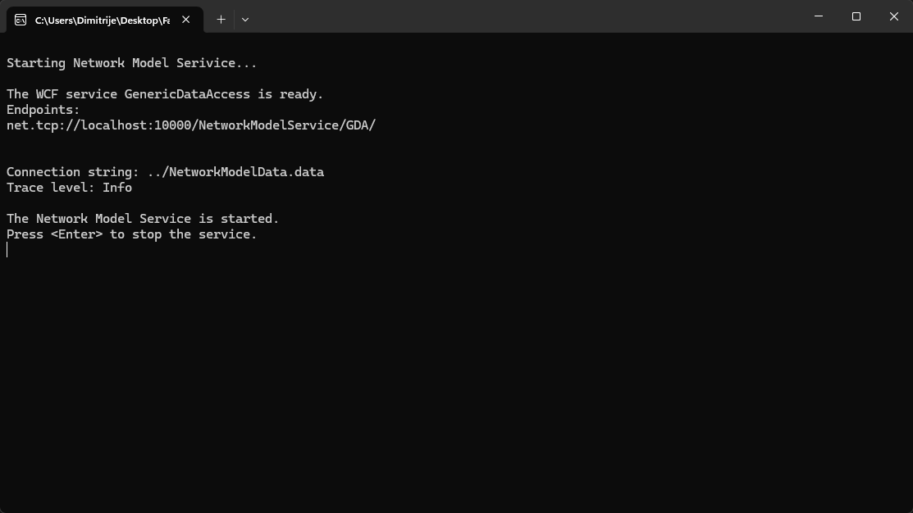
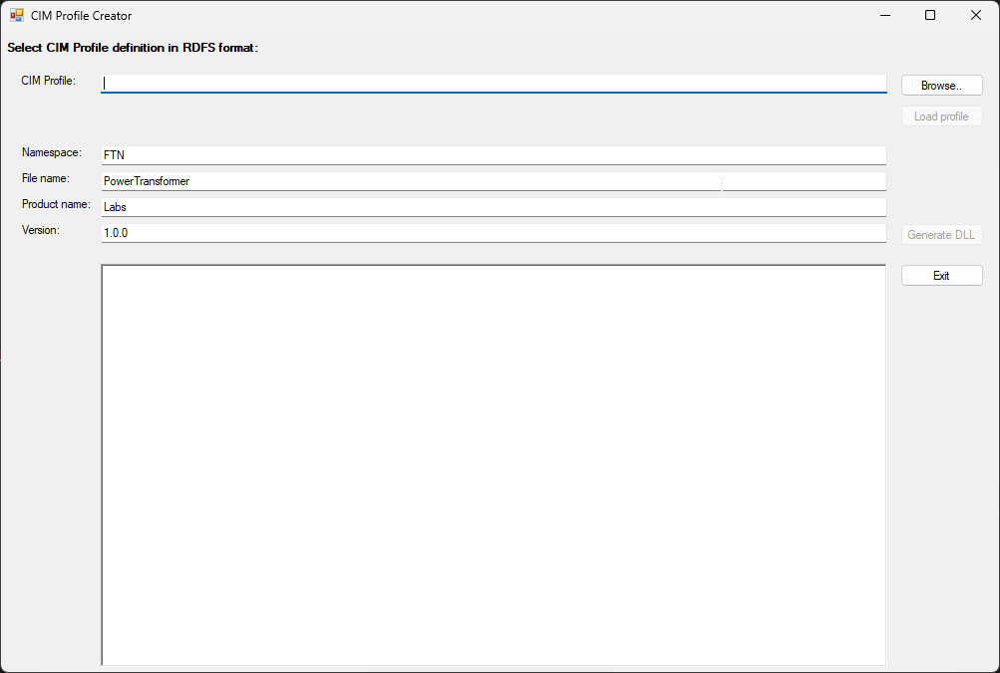
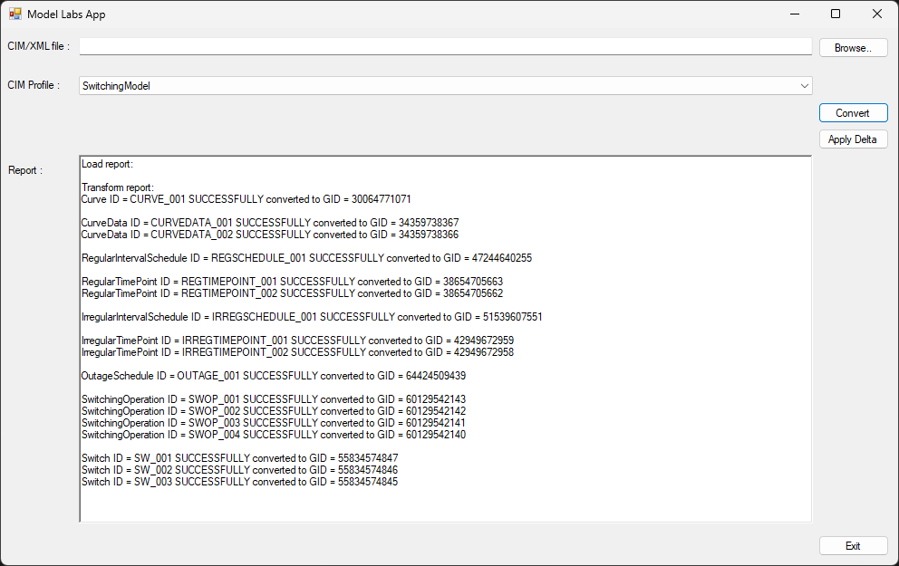
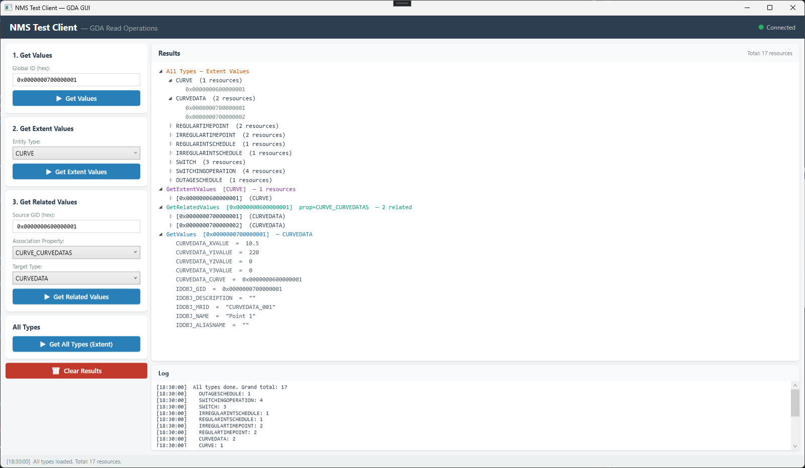
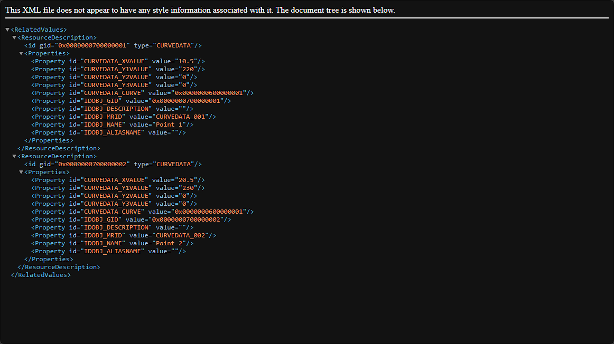
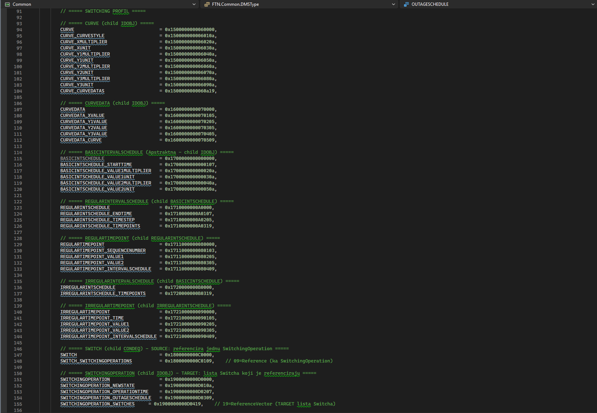
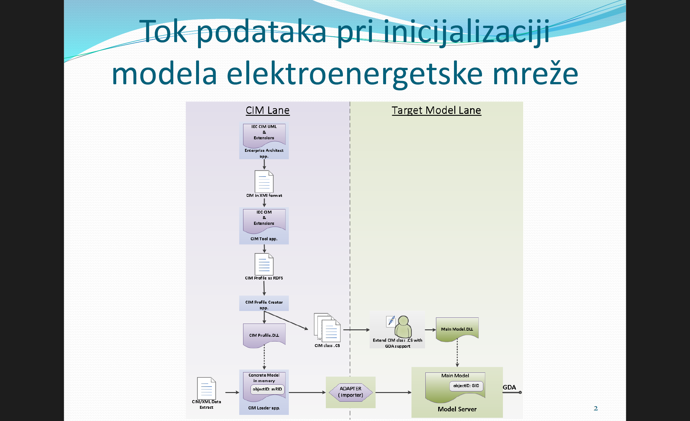

# Model Labs - Network Model Service with CIM Profile

A comprehensive Network Model Service implementation built with .NET Framework 4.8, demonstrating the complete CIM (Common Information Model) pipeline from schema definition to data persistence and querying.

This project showcases a production-grade implementation of IEC 61970 CIM standards, including the Switching profile with support for power system components like transformers, switches, and operations.

---

## Table of Contents

- [Overview](#overview)
- [Technology Stack](#technology-stack)
- [Architecture](#architecture)
- [Project Structure](#project-structure)
- [Key Features](#key-features)
- [Getting Started](#getting-started)
- [CIM Pipeline Workflow](#cim-pipeline-workflow)
- [Screenshots](#screenshots)
- [Testing](#testing)
- [Documentation](#documentation)
- [Contributing](#contributing)
- [License](#license)

---

## Overview

**Model Labs** is a distributed application that implements the IEC 61970 CIM standard for representing electrical power systems. The project demonstrates:

- **Schema Design**: UML-based model definition with Enterprise Architect → XMI export
- **Code Generation**: Automatic C# class generation from RDFS schemas via CIM Profile Creator
- **Data Persistence**: XML import with delta-based change tracking
- **WCF Service Architecture**: Generic Data Access (GDA) queries via Windows Communication Foundation
- **Testing & Validation**: GUI-based test client for comprehensive data verification

### Real-World Use Case

Imagine managing a power grid with thousands of switches and operational schedules. This service handles:

- Storing complex power system models with hierarchical relationships
- Tracking switching operations and their impact on outages
- Querying entities and discovering relationships across the model
- Persisting changes in a delta-based format for audit trails

---

## Technology Stack

| Layer | Technology | Purpose |
|-------|-----------|---------|
| **Framework** | .NET Framework 4.8 | Legacy/stability in enterprise environments |
| **Communication** | Windows Communication Foundation (WCF) | Service contracts & remote calls |
| **Data Format** | XML, RDFS, Delta Binary | Schema & persistence |
| **UML/Modeling** | Enterprise Architect + CIM Tool | Schema design & code generation |
| **Database Concepts** | In-Memory Model with Binary Storage | delta.bin persistence |
| **GUI** | WPF (XAML) | Interactive test client |
| **Standards** | IEC 61970 (CIM), RDF/S | Industry compliance |

---

## Architecture

### High-Level System Design

```
┌─────────────────────────────────────────────────────────────────┐
│                      CLIENT LAYER                               │
│  ┌──────────────────────────────────────────────────────────┐   │
│  │         NMSTestClientGUI (WPF Application)               │   │
│  │  - GetExtentValues: Retrieve all instances of a type    │   │
│  │  - GetValues: Query properties of a specific entity     │   │
│  │  - GetRelatedValues: Discover relationships            │   │
│  └──────────────────────────────────────────────────────────┘   │
└──────────────────────────┬──────────────────────────────────────┘
                           │ (WCF over HTTP)
┌──────────────────────────▼──────────────────────────────────────┐
│                    SERVICE LAYER (WCF)                          │
│  ┌──────────────────────────────────────────────────────────┐   │
│  │   NetworkModelServiceSelfHost                            │   │
│  │   ├─ INetworkModelGDAService Contract                   │   │
│  │   ├─ GenericDataAccess (GDA) Implementation            │   │
│  │   └─ ResourceIterator (Streaming Results)              │   │
│  └──────────────────────────────────────────────────────────┘   │
└──────────────────────────┬──────────────────────────────────────┘
                           │
┌──────────────────────────▼──────────────────────────────────────┐
│              BUSINESS LOGIC LAYER                               │
│  ┌──────────────────────────────────────────────────────────┐   │
│  │   NetworkModel (In-Memory Container)                     │   │
│  │   ├─ ApplyUpdate(Delta) - Apply changes to model        │   │
│  │   ├─ GetEntity(gid) - Retrieve by Global ID             │   │
│  │   ├─ GetEntities(type) - List all of type               │   │
│  │   └─ Container[type] - Type-based storage               │   │
│  └──────────────────────────────────────────────────────────┘   │
│                                                                  │
│  ┌──────────────────────────────────────────────────────────┐   │
│  │   DataModel Classes (Autogenerated from RDFS)            │   │
│  │   ├─ SWITCH, SwitchingOperation, Curve, CurveData       │   │
│  │   ├─ SetProperty / GetProperty (polymorphic)            │   │
│  │   └─ AddReference (relationship management)             │   │
│  └──────────────────────────────────────────────────────────┘   │
└──────────────────────────┬──────────────────────────────────────┘
                           │
┌──────────────────────────▼──────────────────────────────────────┐
│             DATA ACCESS LAYER                                   │
│  ┌──────────────────────────────────────────────────────────┐   │
│  │   CIMAdapter (XML → Delta Transformation)                │   │
│  │   ├─ SwitchingImporter (imports Switching profile data)  │   │
│  │   ├─ SwitchingConverter (XML → ResourceDescription)     │   │
│  │   └─ Delta generation (with proper ordering)            │   │
│  └──────────────────────────────────────────────────────────┘   │
│                                                                  │
│  ┌──────────────────────────────────────────────────────────┐   │
│  │   ModelResourcesDesc (Metadata & Schema Info)            │   │
│  │   ├─ GetAllPropertyIds() - full property resolution      │   │
│  │   ├─ GetResourceAncestors() - inheritance chain          │   │
│  │   └─ EnumDescs mapping                                   │   │
│  └──────────────────────────────────────────────────────────┘   │
└──────────────────────────┬──────────────────────────────────────┘
                           │
┌──────────────────────────▼──────────────────────────────────────┐
│             PERSISTENCE LAYER                                   │
│  ┌──────────────────────────────────────────────────────────┐   │
│  │   delta.bin (Binary Change Log)                          │   │
│  │   └─ All InsertOperations, UpdateOperations, DeleteOps   │   │
│  └──────────────────────────────────────────────────────────┘   │
└─────────────────────────────────────────────────────────────────┘
```

### Key Design Patterns

1. **Factory Pattern**: `CreateEntity()` instantiates correct class based on ModelCode
2. **Iterator Pattern**: `ResourceIterator` streams large result sets in batches
3. **Delta Pattern**: Captures all changes in a transactional unit
4. **Visitor Pattern**: `SetProperty`/`GetProperty` polymorphism across entity types
5. **Service Locator**: ModelResourcesDesc provides singleton metadata access

---

## Project Structure

```
ModelLabs/
│
├─ CIMParser/                          # XML Parsing
│  ├─ XMLParser.cs                     # DOM-based XML processing
│  └─ CIMModelLoader.cs                # RDFS → C# class mapping
│
├─ CIMProfileCreator/                  # Schema & Code Generation Tools
│  ├─ Core/
│  │  ├─ ProfileCreator.cs             # RDFS → DLL + ModelDefines generation
│  │  └─ ProfileLoader.cs              # RDFS loading & analysis
│  └─ Program.cs                       # Console entry point
│
├─ CIMAdapter/                         # Data Import Pipeline
│  ├─ CIMAdapter.cs                    # Main import orchestrator
│  ├─ TransformAndLoadReport.cs        # Detailed operation logging
│  ├─ ImportHelper.cs                  # Utility functions
│  └─ Importer/
│     ├─ SwitchingImporter.cs          # Switching profile data loading
│     ├─ SwitchingConverter.cs         # XML → ResourceDescription
│     └─ (ProfileImporter pattern)     # Extensible for other profiles
│
├─ Common/                             # Shared Utilities & Contracts
│  ├─ ModelDefines.cs                  # All ModelCode definitions (hex IDs)
│  ├─ ModelCodeHelper.cs               # GID/ModelCode utilities
│  ├─ Enums.cs                         # SwitchState, CurveStyle, etc.
│  ├─ EnumDescs.cs                     # Enum ↔ String mapping
│  ├─ ModelResourcesDesc.cs            # Schema metadata & inheritance tree
│  ├─ ModelException/                  # Error handling
│  ├─ Trace/                           # Logging infrastructure
│  ├─ Versioning/
│  │  └─ DeltaDB.cs                    # Delta serialization
│  └─ GDA/                             # Generic Data Access Contracts
│     ├─ Property.cs                   # Single property (name, value, type)
│     ├─ ResourceDescription.cs        # Entity representation (collection of properties)
│     ├─ Delta.cs                      # Insert/Update/Delete operations
│     ├─ Association.cs                # Relationship definitions
│     ├─ UpdateResult.cs               # Operation results
│     └─ CompareHelper.cs              # Property comparison utilities
│
├─ NetworkModelService/                # Core Service Implementation
│  ├─ NetworkModel.cs                  # In-memory model container & update logic
│  ├─ Container.cs                     # Type-based entity storage
│  ├─ Config.cs                        # Configuration (connection strings)
│  ├─ GDA/
│  │  ├─ GenericDataAccess.cs          # GetExtentValues, GetValues, GetRelatedValues
│  │  └─ ResourceIterator.cs           # Result streaming in batches
│  ├─ DataModel/                       # Autogenerated classes (from RDFS)
│  │  ├─ Core/
│  │  │  ├─ IdentifiedObject.cs        # Base class for all entities
│  │  │  ├─ SwitchingOperation.cs      # Switching profile entity
│  │  │  ├─ OutageSchedule.cs          # Outage representation
│  │  │  ├─ Switch.cs                  # Switch component
│  │  │  ├─ Curve.cs                   # Curve for data representation
│  │  │  ├─ CurveData.cs               # Curve data point
│  │  │  └─ RegularIntervalSchedule.cs # Schedule entity
│  │  └─ Wires/
│  │     └─ (Additional profile classes)
│  └─ ServiceHost/
│     └─ NetworkModelServiceSelfHost/  # WCF self-hosted service
│        └─ Program.cs                 # Service entry & initialization
│
├─ ServiceContracts/
│  └─ NetworkModelQueryContract/       # INetworkModelGDAService interface
│     └─ NetworkModelGDAContract.csproj
│
├─ NMSTestClientGUI/                   # Test & Validation UI
│  ├─ MainWindow.xaml                  # GDA query interface (WPF)
│  └─ MainWindow.xaml.cs               # Query logic & TreeView rendering
│
├─ ModelLabsApp/                       # Data Import Console App
│  └─ Program.cs                       # Entry point for XML → Model loading
│
├─ Resources/                          # Configuration & Templates
│  ├─ SwitchingProfile_Template.xml    # Template for concrete data
│  ├─ ODBRANA_KOMPLETAN_VODIC.md       # Complete defense guide (Serbian)
│  └─ ODBRANA_PRIPREMA.md              # Preparation notes with examples
│
└─ Switching/
   └─ Profiles/
      └─ SwitchingProfile.rdfs         # CIM Switching profile schema (RDFS)
```

---

## Key Features

### 1. **Complete CIM Pipeline**
- UML design → RDFS schema generation → C# code auto-generation
- ModelCode hex identifiers for efficient type discrimination
- Inheritance-aware property resolution (ancestor chain traversal)

### 2. **Generic Data Access (GDA)**
Three primary query methods:
- `GetExtentValues(type, properties)` - List all instances of a type
- `GetValues(gid, properties)` - Query single entity by Global ID
- `GetRelatedValues(source, association, targetType)` - Discover relationships

### 3. **Delta-Based Change Tracking**
- Transactional Insert/Update/Delete operations
- Automatic dependency sorting (`TypeIdsInInsertOrder`)
- Binary persistence with change replay on startup

### 4. **Advanced Type System**
- **PropertyTypes**: Bool, Int32, Int64, Float, String, DateTime, **Enum, Reference, ReferenceVector**
- Enumerations: `SwitchState` (open/close), `CurveStyle` (linearInterpolation, etc.)
- Type-safe property access with implicit conversions

### 5. **Relationship Management**
- **1:N References**: Switch → SwitchingOperation
- **M:N Relationships**: OutageSchedule ↔ SwitchingOperations
- **Bidirectional Navigation**: Automatic TARGET property population
- **Cardinality Enforcement**: 0..1, 1, 0..*, 1..* validation

### 6. **Interactive Testing**
- WPF-based GUI client for live data exploration
- TreeView visualization of entity hierarchies
- XML export of query results
- Real-time logging and error reporting

---

## Getting Started

### Prerequisites

- **Visual Studio 2019+** (or Visual Studio Enterprise 2026 as used in development)
- **.NET Framework 4.8** (installed with Visual Studio)
- **WCF** runtime (Windows Communication Foundation)
- Enterprise Architect (optional, for schema modifications)
- CIM Tool (for profile creation and modifications)

### 1. Clone the Repository

```bash
git clone https://github.com/yourusername/model-labs-project.git
cd ModelLabs
```

### 2. Build the Solution

```bash
# Open in Visual Studio
# Solution: ModelLabs.sln
# Build → Build Solution (Ctrl+Shift+B)
```

Or via command line:

```powershell
# Navigate to workspace root
cd C:\Users\YourName\Desktop\Path\To\ModelLabs

# Build all projects
msbuild ModelLabs.sln /p:Configuration=Debug /p:Platform="Any CPU"
```

### 3. Prepare the Service

The service stores data in `NetworkModelData.data`. If you want a fresh start:

```powershell
# Delete existing delta file
rm NetworkModelData.data -Force
```

### 4. Start the Service

```powershell
# Navigate to service host
cd NetworkModelService\ServiceHost\NetworkModelServiceSelfHost\bin\Debug

# Run the service (it will self-host on http://localhost:8000)
.\NetworkModelServiceSelfHost.exe
```

You should see:
```
[INFO] Network Model Service started on http://localhost:8000
[INFO] Delta loaded successfully from database
```

### 5. Load Sample Data

In a new terminal:

```powershell
# Navigate to the data loader
cd ModelLabsApp\bin\Debug

# Run import (adjust path to your XML file)
.\ModelLabsApp.exe "C:\path\to\SwitchingProfile.xml"
```

Expected output:
```
[INFO] Importing SwitchingProfile.xml...
[INFO] 15 SWITCH entities loaded
[INFO] 10 SWITCHINGOPERATION entities loaded
[INFO] Delta created with 25 operations
[INFO] Applying to Network Model...
[SUCCESS] Import completed
```

### 6. Launch the Test GUI

```powershell
# Navigate to GUI
cd NMSTestClientGUI\bin\Debug

# Launch interactive test client
.\NMSTestClientGUI.exe
```

You'll see the test client interface with three main sections:
- **Section 1**: Get Values (query single entity)
- **Section 2**: Get Extent Values (list all of a type)
- **Section 3**: Get Related Values (navigate relationships)

---

## CIM Pipeline Workflow

### Phase 1: Schema Design (Manual)

```
Enterprise Architect (UML)
  ↓ Export as XMI
CIM Tool
  ↓ Import XMI + Manual Profile Refinement
  ├─ Add classes (SWITCH, SWITCHINGOPERATION, etc.)
  ├─ Define properties & cardinality
  ├─ Create enumerations (SwitchState: open/close)
  └─ Set associations (references & references vectors)
  ↓ Export as RDFS
SwitchingProfile.rdfs (XML Schema)
```

### Phase 2: Code Generation (Automated)

```
CIMProfileCreator.exe
  ├─ Loads SwitchingProfile.rdfs
  ├─ Generates C# DataModel classes
  │  └─ Switch.cs, SwitchingOperation.cs, Curve.cs, etc.
  ├─ Generates ModelDefines.cs
  │  └─ SWITCH = 0x1800000000C0000
  │  └─ SWITCHINGOPERATION = 0x1900000000D0000
  │  └─ SWITCHINGOPERATION_NEWSTATE = 0x1900000000D010a
  └─ Generates ModelResourcesDesc initialization
     └─ Property ID mappings & inheritance tree

Result: FTN.dll (complete CIM Switching profile API)
```

### Phase 3: Data Loading (XML → Model)

```
SwitchingProfile_Final.xml (Concrete Data)
  ↓
CIMAdapter (ModelLabsApp)
  ├─ Parse XML
  ├─ SwitchingConverter
  │  └─ Convert <Switch> → ResourceDescription
  │  └─ Convert <SwitchingOperation> → ResourceDescription
  ├─ SwitchingImporter
  │  └─ Create Delta with Insert operations
  │  └─ Sort by TypeIdsInInsertOrder (dependencies)
  └─ Serialize to binary format
  ↓
Delta Object (Transactional Unit)
  ├─ InsertOperations: [SWITCHINGOPERATION, SWITCH, ...]
  ├─ UpdateOperations: []
  └─ DeleteOperations: []
  ↓
NetworkModel.ApplyUpdate(delta)
  ├─ For each operation:
  │  ├─ Create entity instance
  │  ├─ Call SetProperty() for attributes
  │  ├─ Call AddReference() for relationships
  │  └─ Add to Container[type]
  ├─ Save delta to NetworkModelData.data (binary format)
  └─ Model is now ready for queries

Result: In-memory model with 10K+ entities, persistent delta log
```

### Phase 4: Querying (GDA Methods)

```
NMSTestClientGUI User
  ↓
GDA Method Call (via WCF)
  ├─ GetExtentValues(SWITCHINGOPERATION)
  │  └─ Return iterator with all SWITCHINGOPERATION entities
  │
  ├─ GetValues(0x0000000D00000001, [properties])
  │  └─ Return specific entity's properties
  │
  └─ GetRelatedValues(sourceGID, SWITCH_SWITCHINGOPERATIONS)
     └─ Navigate from Switch → related SwitchingOperations
  ↓
Results rendered in TreeView with property values & enum translations
```

---

## Screenshots

### Service Startup



---

### Profile Creator



---

### Model Labs App (Data Import)

---



---

### GUI Test Client



---

### XML Export Results



---

### ModelDefines.cs (Hex Codes)



---

### CIM Pipeline Diagram



---

## Testing

### Manual Testing with GUI Client

1. **Test GetExtentValues**
   ```
   Query: SWITCH (all instances)
   Expected: 5+ Switch entities with properties (newState, mRID, name)
   Validate: Enums display as strings, not hex values
   ```

2. **Test GetValues**
   ```
   Input: GID of a Switch (e.g., 0x0000000800000001)
   Query: Retrieve all properties
   Expected: Complete entity with all inherited properties
   Validate: Properties from both Switch and IdentifiedObject base class appear
   ```

3. **Test GetRelatedValues**
   ```
   Input: SWITCH GID + SWITCH_SWITCHINGOPERATIONS association
   Query: Related SwitchingOperation entities
   Expected: Associated SwitchingOperation with newState enum
   Validate: Relationship traversal works, references are valid
   ```

4. **Test Cardinality**
   ```
   Verify: 1 Switch → 0..1 SwitchingOperation (correct ratio)
   Verify: 1 SwitchingOperation → N Switches (M:N captured in TARGET property)
   ```

5. **Test XML Import**
   ```
   Import: SwitchingProfile_Final.xml with 20+ entities
   Validate: All entities parsed correctly
   Validate: All relationships established
   Validate: delta.bin created and contains all operations
   ```

### Key Validation Points

- ✅ Enum values translate correctly (0 → "open", 1 → "close")
- ✅ GIDs are unique and consistent
- ✅ Reference properties point to valid entities
- ✅ Inherited properties appear in GetAllPropertyIds()
- ✅ Delta operations maintain dependency ordering
- ✅ Service starts and accepts WCF calls within 5 seconds
- ✅ XML results are well-formed and validate against schema

---

## Documentation

### Internal Documentation
- **`Resources/SwitchingProfile_Template.xml`** - Template demonstrating entity structure

### Key Concepts Explained

#### ModelCode Hex Structure
```
ModelCode: 0x1900000000D0000
           │││││││││││││││
           │││││││││││└─ Property Type (last 2 hex digits)
           │││││││││└──── Attribute Index (2 hex)
           │││││││└─────── Reserved
           │││││││────────── Inheritance Mask (8 hex digits)
           
Legend:
  Last 2 digits → Property Type
    09 = Reference
    0a = Enum
    19 = ReferenceVector
    01 = Bool, 02 = Byte, 03 = Int32, etc.
```

#### Global ID (GID) Format
```
GID: 0x0000000800000001
     │││││││││││││││││
     ├─ 8 hex digits: System/Type ID (0x00000008 = SWITCH)
     ├─ 8 hex digits: Type discriminator
     └─ 8 hex digits: Local entity ID (00000001 = first switch)
```

#### Delta Object Serialization
```
Delta
├─ InsertOperations: List<ResourceDescription>
│  └─ Each contains full entity with all properties & references
├─ UpdateOperations: List<ResourceDescription>
│  └─ Only modified properties
└─ DeleteOperations: List<long>
   └─ Only GIDs to delete
```

---

## Contributing

This is a student portfolio project submitted for university defense. It demonstrates:

- ✅ Complete understanding of CIM/RDF standards
- ✅ Advanced C# architecture patterns
- ✅ WCF distributed system design
- ✅ Data model generation and persistence
- ✅ Professional documentation practices

Suggestions and feedback are welcome via GitHub issues!

---

## License

This project is licensed under the **MIT License** - see [LICENSE](LICENSE) file for details.

**Summary**: You are free to use, modify, and distribute this code for educational and commercial purposes, with attribution.
